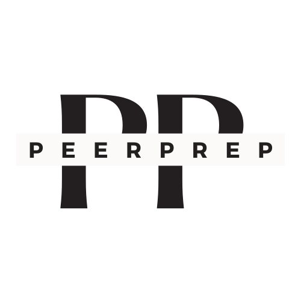

# PeerPrep - Technical Interview Preparation and Peer Matching Platform

<p align="center">

</p>

PeerPrep is a technical interview preparation platform and peer matching system designed to help students practice whiteboard-style interview questions with their peers. With PeerPrep, you can easily find a study partner who shares your passion for technical interview success. This README provides an overview of the platform and its features, as well as essential information for developers and users.

## Table of Contents
1. [Features](#features)
2. [Tech Stack](#tech-stack)
3. [Installation](#installation)
4. [Usage](#usage)
5. [Deployment](#deployment)

## Features <a name="features"></a>
PeerPrep is designed to simplify the technical interview preparation process. Some key features of the application include:

- User Registration and Authentication: Students can create an account and log in to access the platform's features securely.

- Question Selection: Users can choose the difficulty level (easy, medium, or hard) and a specific topic they want to work on for the day.

- Peer Matching: PeerPrep uses a matching service with RabbitMQ to pair users with others who have selected the same difficulty level and topic. If a match is not found within a specific duration, the user times out.

- Real-Time Collaboration: Once matched, users are provided with a collaborative space to develop their solutions in real-time. This space allows both the user and their matched peer to work together on the selected question.

- Graceful Termination: Users can gracefully terminate their collaborative sessions when they are done.

- More detailed functional and non-functional requirement are in the Project Report under team repo.


## Tech Stack <a name="tech-stack"></a>
PeerPrep is built using a modern tech stack to ensure robustness and scalability:

- Frontend:
    - Next.js with TypeScript
    - React.js with JavaScript

- Backend:
    - Node.js

- Database:
    - MongoDB
    - PostgreSQL

- Authentication:
    - nextAuth

- CI/CD and Cloud:
    - GitHub for version control
    - Google Cloud Platform (GCP) for continuous integration and continuous deployment

- Containerization:
    - Docker
    - Docker Compose
    
- Message Broker:
    - RabbitMQ

- Collaborative Service:
    - Liveblocks with WebSocket support


## Installation <a name="installation"></a>
To run PeerPrep locally for development purposes, follow these steps:

1. Clone the GitHub repository to your local machine.
```bash
    git clone https://github.com/CS3219-AY2324S1/ay2324s1-course-assessment-g25.git
    cd ay2324s1-course-assessment-g25
```
2. In order to set up the Docker image and container, first need to install Docker Desktop on your local computer.

Check out [Docker Desktop Installation](https://www.docker.com/products/docker-desktop/), and [Docker Docs](https://docs.docker.com/desktop/) for more information.

3. With Docker Desktop and Our Assignment folder, enter:

```bash
    docker-compose up
```
Or you can go into each service folder and run the npm to start the service:

Frontend:

```bash
    cd frontend
    npm install
    npm ci
    npm run dev
```

Collaboration Service:

```bash
    cd collaboration-service
    npm install
    npm ci
    npm run dev
```

History Service:

```bash
    cd history-service
    npm install
    npm ci
    npm run start
```

Matching Service:

```bash
    cd matching-service
    npm install
    npm ci
    npm start
```

Question Service:

```bash
    cd question-service
    npm install
    npm ci
    npm run dev
```

User Service:

```bash
    cd user-service
    npm install
    npm ci
    npm run dev
```

4. Once the containers are up and running, you can access your PeerPrep environment by opening a web browser and navigating to [local host](http://localhost:3000/). 

5. If you want to shut down the container and delete them, enter:

```bash
    docker-compose down --rmi all -v
```


## Usage <a name="usage"></a>
Using PeerPrep is straightforward:

1. Create an account and log in.

2. Select the desired difficulty level and topic you want to practice.

3. Wait for the system to match you with a peer. If a match is found, start your collaborative session. If not, you will time out.

4. During the collaborative session, work on the provided question with your peer.

5. When you are done, terminate the session gracefully.

## Deployment <a name="deployment"></a>

[](https://classroom.github.com/a/6BOvYMwN)


[](https://github.com/CS3219-AY2324S1/ay2324s1-course-assessment-g25/actions/workflows/frontend.yaml)

[](https://github.com/CS3219-AY2324S1/ay2324s1-course-assessment-g25/actions/workflows/collaboration.yaml)

[](https://github.com/CS3219-AY2324S1/ay2324s1-course-assessment-g25/actions/workflows/matching.yaml)

[](https://github.com/CS3219-AY2324S1/ay2324s1-course-assessment-g25/actions/workflows/question.yaml)

[](https://github.com/CS3219-AY2324S1/ay2324s1-course-assessment-g25/actions/workflows/user.yaml)

[](https://github.com/CS3219-AY2324S1/ay2324s1-course-assessment-g25/actions/workflows/nextjs.yml)

[](https://github.com/CS3219-AY2324S1/ay2324s1-course-assessment-g25/actions/workflows/pages/pages-build-deployment)


PeerPrep is designed to make technical interview preparation more accessible and collaborative. We welcome contributions, bug reports, and feature requests to help improve the platform. Feel free to reach out to us with any questions or feedback. Happy coding!
